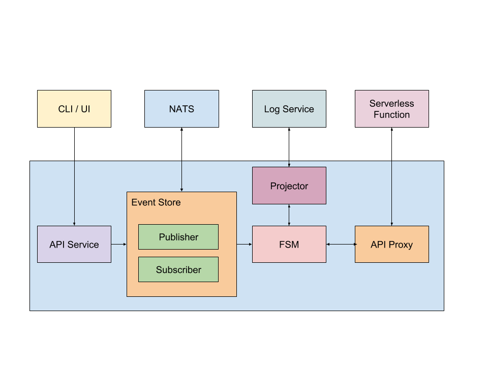

# Mercury
A step function implementation for connecting different cloud platform.

## Goal
The goal of this project is to build a scalable and fault-tolerant workflow system to connect serverless function on different cloud provider or your own platform.

## Philosophy
Instead of choosing to design workflow for specific platform, we build a universal solution based on same protocol. For now, different serverless provider usually share same API design Philosophy, Mercury only do works by using "invoke" interface.
State machine language is used to describe function workflow. Mercury chooses a standard that is compatible for most serverless providers.

## Protocol
Invoke interface should provide events and log interface.
State machine language in first stage will choose Amazon State Language as template, and will add more complex logic in future stage. You can find more details for this spec in
[Amazon State Language](https://states-language.net/spec.html)

## Architecture

#### Fast: 
The serialization method is Protocol Buffers, which takes like less time and results to higher compressed environment than most other serialization methods.

#### Scalability:
Mercury aims to run distributed workflow on multiple cores on multiple machines. NATS streaming system is a good candidate for communication option since it supports for request reply, which can be used to implement both sync and async request.

#### Fault-Tolerance:
Mercury retrieves the log service regularly. If the task hangs up or failed, system chooses to retry and builds a new state machine.

## Explanation
Term | Explanation
 :---: |  :---:
NATS  | Cloud-Native message system. Commit-Log Paradigm and supports for Request Reply
Log Service | 
 ElasticSearch Cluster Service  

Projector | Constructor and Reconstruct FSM
API Proxy |  Invoke Serverless Function from Third Party Service 

## Usage
On the way
